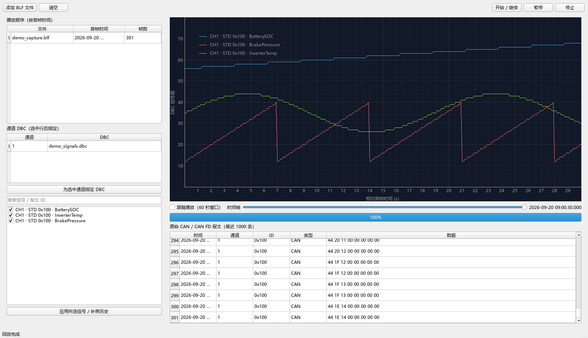
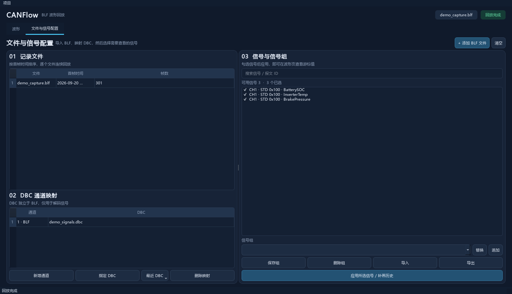
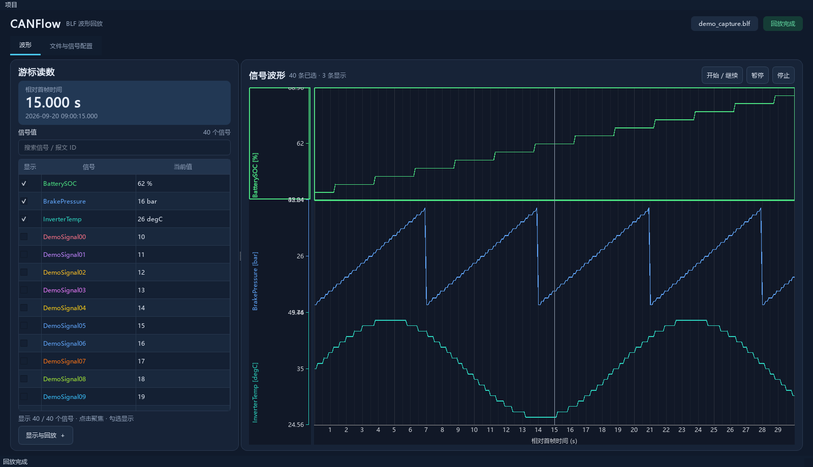

# CANFlow v2.0.1

桌面 BLF 波形回放工具。V2 增加项目、可复用信号组和多纵轴波形。多选 BLF 后按各文件最早采集时间排序，逐文件快速处理 CAN/CAN FD 数据；波形横轴保留原始采集时间和文件间空白。文件时间范围重叠会在导入时阻止回放。







截图使用程序生成的示例 CAN 数据。

## 启动

需要 Python 3.10 或更新版本。在项目目录执行：

```powershell
python -m venv .venv
.venv\Scripts\python.exe -m pip install -r requirements.txt
.venv\Scripts\python.exe run.py
```

无需安装 Python 时，可从 [Releases](https://github.com/lingPoint/CANFlow/releases) 下载最新提交对应的 `CANFlow.exe`。每次推送代码后，GitHub Actions 会在 Windows 上运行测试并打包单文件 EXE；构建成功后创建一个以提交 SHA 命名的预发布版本。EXE 不包含 BLF 或 DBC 文件，请自行选择本地记录和配置。

开发与测试另装 `requirements-dev.txt`，然后运行 `.venv\Scripts\python.exe -m pytest -q`。
真实 1 GiB BLF 压测默认跳过；在有足够临时磁盘空间时设置 `CANFLOW_TEST_1GB=1` 并运行 `pytest tests/test_large_blf.py -s`。
多通道压测会自行生成 1 GiB 临时 BLF；也可先执行
`.venv\Scripts\python.exe scripts\generate_multichannel_blf.py .test-data\multichannel-1g.blf`
保留这份数据及两份通道 DBC，再设置 `CANFLOW_MULTICHANNEL_BLF` 为该 BLF 的绝对路径复用它。
`.test-data` 不加入 Git，以免仓库携带 1 GiB 二进制文件。

## 使用

1. 切换到“文件与信号配置”页，从“项目”菜单新建项目，在“项目 DBC 映射”中手动新增通道并指定 DBC。映射独立于 BLF；项目保存 DBC 路径和当前信号选择，不复制 DBC 或 BLF。
2. 在配置页点击“添加 BLF 文件”并多选记录文件。预检会扫描每个文件，因此大型记录首次导入需要时间。BLF 中未配置 DBC 的通道仍显示原始报文。
3. 在配置页勾选信号并点击“应用所选信号”，或从信号组选择“替换”“追加”。“保存组”把当前选择保存到全局组库；信号组也可以单独导入、导出。
4. 点击“开始 / 继续”。“暂停”“停止”和时间轴可控制处理进度。勾选“跟随播放”显示最近时间窗口；取消后可用鼠标缩放和平移历史波形。
5. 切换到“波形”页查看曲线。波形标题栏显示游标时间，左侧显示已选信号的游标值，可搜索并滚动查看 30–40 个信号；默认只在图上显示前 3 条曲线，勾选列表中的信号可添加到波形，点击信号可聚焦。每条可见曲线使用独立 Y 范围，共享时间轴。Ctrl+滚轮同步缩放可见轨道的纵轴。
6. “显示与回放”默认收起，可在其中调整曲线设置并打开回放详情。时间轴、进度和原始报文默认隐藏，展开状态会自动记住。
7. 处理完成后勾选其他信号会自动补画历史。程序会重新读取 BLF，无需重新导入。若信号在该 BLF 中没有可解码数据，界面会说明原因。

项目文件扩展名为 `.canflow.json`。程序优先使用相对 DBC 路径，并保留绝对路径作为后备；DBC 缺失或定义发生变化时会保留未解析信号并提示用户重新配置。独立信号组文件使用 `.canflow-signals.json`。

信号点缓存放在系统临时目录，退出程序时清理。波形按视野抽样绘制，原始信号点保存在 SQLite 临时缓存中。

## 许可

CANFlow 源码公开，按 [PolyForm Noncommercial License 1.0.0](LICENSE.md) 授权，仅允许许可证规定的非商业用途。商业使用需要另行取得仓库所有者的许可。此许可证不是 OSI 开源许可证。

## 当前限制

- 原始报文表显示最近 1000 条，供查看通道和数据；完整 BLF 始终保留在原文件中。
- 同一 BLF 内的多通道报文即使时间戳不按文件顺序递增，也可按原始文件顺序回放；波形保留每帧的采集时间。跨文件的采集时间范围重叠仍会在导入时阻止回放。
- 曲线数量没有硬限制；大量曲线同时显示时会分批刷新，实际流畅度取决于机器性能和可见时间范围。
