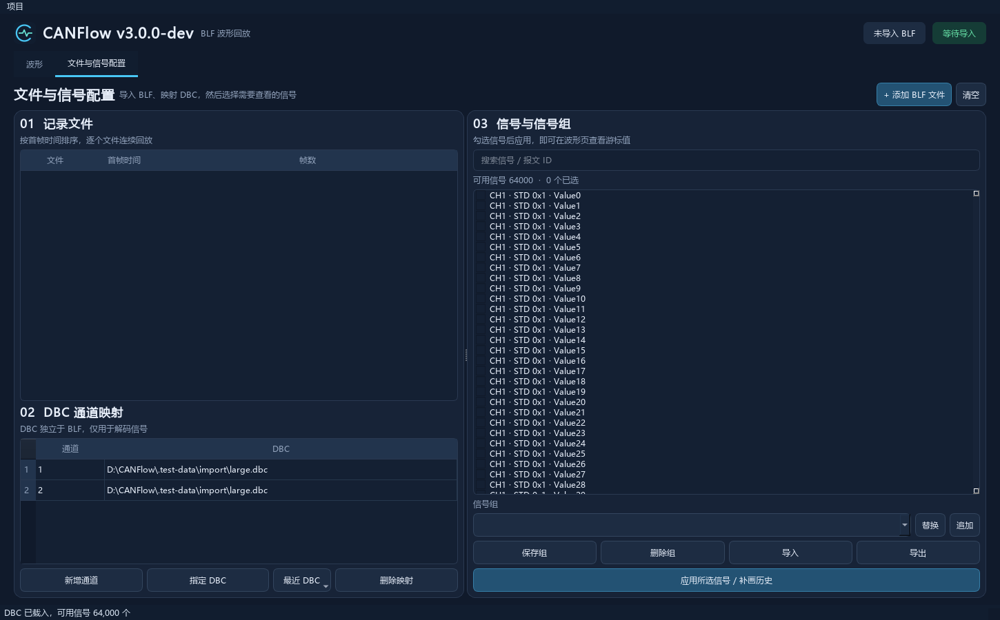

# V3 导入性能优化

本次针对多个 GiB 级 BLF 添加缓慢，以及指定 DBC 时界面停顿的问题。

## 原因与修改

- 原 BLF 预检逐帧创建 `can.Message`、复制数据、用 Decimal 转换时间戳，再提取少量统计信息。现在复用 python-can 的容器解压与跨容器缓冲，只读取时间戳、通道、报文 ID、类型和有效载荷长度，累计整数时间边界后统一换算。
- 仍扫描所有对象，保留 CAN/CAN FD 有效帧计数、最早/最晚时间、通道与最大报文长度；不以文件头、抽样或首尾帧代替完整预检。时间戳回退和跨文件重叠检查保持原语义。
- BLF 状态栏每约 100 ms 更新一次当前文件、文件序号和读取百分比。停止/切换项目会丢弃未提交的导入结果，原文件列表不变；未变化文件仍复用有容量限制的会话缓存。
- 原 DBC 指定操作在 GUI 线程加载旧映射、加载新映射，并在曲线同步时再次解析。现在后台准备完整映射和信号选择，成功后一起应用；失败保留旧映射和选择。取消或新建项目后，旧任务不会回写。
- DBC 解析结果以规范路径及文件大小、修改时间、创建时间、文件标识校验后复用，最多缓存 32 个文件。结果只读共享，文件变更或读取中变化会失效/报错。
- 信号列表使用统一行高、分批布局，并按约 8 ms 的工作片段填充，避免数万个项目一次性阻塞事件循环。填充期间保存项目仍使用完整信号选择。

## 测量条件

Windows，同一 Python 3.12.14 运行时、python-can 4.6.1、cantools 40.7.1、PySide6 6.11.2。
基线来自优化前工作树（`404d3c97f87114663cd4bad384c46f9cee470905`）。结果是本机单次测量，受磁盘缓存、硬件、文件压缩率和报文结构影响。

BLF 为三个不同路径、不同采集时间范围的合成文件，共 3,224,371,440 字节；每个文件 9,840,000 帧、16 通道，混合经典 CAN、CAN FD 和通道时间戳回退。
首次扫描指应用预检缓存为空，不代表操作系统冷磁盘缓存。DBC 为合成的 1,000 个报文、32,000 个信号，同一文件先后映射到两个通道，最终展示 64,000 个信号。

## 结果

| 指标 | 优化前 | 优化后 |
|---|---:|---:|
| 三个约 1 GiB BLF 首次完整预检 | 73.677 s | 28.936 s |
| 同一会话再次预检这三个未变化文件 | 0.589 ms | 0.504 ms |
| 首次指定 DBC，直至 32,000 个信号可用 | 4.689 s | 4.547 s |
| 首次指定 DBC，最大 GUI 事件间隔 | 4.499 s | 0.109 s |
| 同一 DBC 指定第二个通道，直至 64,000 个信号可用 | 10.306 s | 0.935 s |
| 第二次指定 DBC，最大 GUI 事件间隔 | 9.924 s | 0.257 s |

首次 BLF 预检耗时减少 **60.7%**（约 2.55 倍速度）。三个文件的所有预检元数据与基线完全一致。
通过 `MainWindow._add_files()` 发起的真实 Qt 导入耗时 29.845 s，最大 GUI 事件间隔 25.9 ms；测试期间波形页可见，最终三个文件均已入表。DBC 数值单独在配置页实际可见、加载中文字体时测得，包含列表填充与绘制。

原始数据：[基线](performance/import-baseline.json)、[优化后](performance/import-result.json)。



## 验证

自动回归覆盖无逐帧报文分配、压缩/未压缩容器与跨容器对象、v1/v2 对象头、CAN_MESSAGE2、CAN_FD_MESSAGE_64、截断负载补零、两种时间单位、远程帧/错误帧过滤、取消、尾部截断、缓存失效与容量、背景 DBC 解析、共享解析结果、加载失败回滚、切换项目、分批填充期间选择保留、重叠文件拒绝。

另对仓库实际 BLF 样本、500,666,352 字节随机记录、1,074,366,824 字节多通道记录逐项对照旧扫描器，全部元数据一致。

完整常规测试 **65 passed，3 skipped**；跳过的是原有可选 GiB 级回放压测，本轮另外执行了上面的多 GiB 导入实测。
64 MiB、16 通道界面回放回归保留全部 620,000 个样本，16 条可见轨道与尖峰检查通过，已目视核对波形截图；结果见 [回放回归 JSON](performance/import-replay-regression.json)。

## 复现

```powershell
python -c "from pathlib import Path; from scripts.benchmark_v3 import generate; generate(Path('.test-data/v3'), 1024)"
python -m scripts.benchmark_import --label measured --ui-blf
python -m pytest -q
```

需要约 4 GiB 可用磁盘；生成源数据后会创建两份时间范围不同的副本。JSON 与 Qt 截图保存在 `.test-data/import`。仅测 DBC 可使用 `--skip-blf`。

完整扫描仍与文件数据量成正比；DBC 首次解析仍需要 CPU 时间，但在后台执行。缓存限于当前进程，不提供跨重启持久化索引。打开项目的完整恢复流程仍沿用原有同步逻辑，本次异步化针对“指定 DBC”操作。
