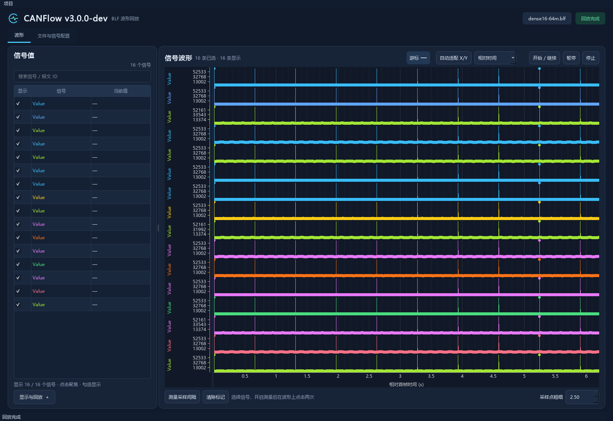

# V3：GiB 级 16 通道回放性能

2026-09-25，分支 `v3`，开发版本 `3.0.0-dev`。保留进入分支前已有的界面、采样点和测量改动。

## 处理方式

- 每次回放按通道、帧 ID 和标准/扩展帧类型准备解码器。相同路径的 DBC 只加载一次。非复用 Intel 整数信号预计算位范围，并沿用 cantools 的物理值换算；Motorola、浮点和复用报文保留通用解码路径。
- 每批最多约 16,000 个样本按信号排序写入 SQLite；一帧包含多个信号时可能略超过该阈值。原始样本和概览在同一事务提交。原有相同信号、时间、值去重规则保持不变。
- 根据整段采集时间建立 25,600 桶和 1,600 桶两级概览，每桶保留最小值、最大值及最早的真实样本。概览不会丢掉孤立尖峰。视窗边缘和近距离缩放查询原始样本，避免引入视窗外极值；游标和间隔测量始终查询原始点。
- 概览是显示抽样：每桶极值画在其首个样本位置，横向精度随缩放恢复；真实采样标记使用真实记录的时间和值，不能用概览连接线测量精确时间。
- UI 每 100 ms 取最新进度快照，工作线程约每 250 ms 发布。快照始终只有一份，原始报文最多保留最近 1,000 条，慢界面不会积压跨线程历史更新。
- 原始表复用现有单元格；视窗和缓存未变化时跳过重复绘图。追加 BLF 时会复用会话内最多 32 个未变化文件的预检结果；文件大小、修改时间、创建时间或文件标识变化会触发重扫。
- 跳转可跳过时间范围完全早于目标的文件；单文件内部仍顺序读取。文件仍按采集时间逐个处理，保留多通道时间戳回退、文件间空白和重叠校验。

## 可复现压力场景

`python -m scripts.benchmark_v3 --size-mib 1024 --label run1 --ui`

脚本创建实际大于 1 GiB 的无压缩 BLF：16 通道、984 万帧，全部帧均需解码，一个信号/通道。混合 8 字节 CAN 与 64 字节 CAN FD；不同通道在文件中存在微小时间戳回退。信号含变化值和孤立尖峰，验证完整样本数量、可见峰值和真实采样点。Qt 窗口同时显示 16 条轨道，并用 20 ms 心跳记录界面响应间隔。

文件在 `.test-data/v3` 中复用，每次测试使用不同 `--label`；样本缓存不可复用，防止去重使重测结果失真。可先使用 `--size-mib 64` 快速检查。Windows 普通测试默认跳过大文件场景；设置 `CANFLOW_TEST_16CH=1` 可通过 pytest 单独运行。

同机对比使用 Python 3.12.14、python-can 4.6.1、cantools 40.7.1、bitstruct 8.23.0 的 CPython 3.12 编译模块。旧 `.venv` 指向失效的 Store Python 3.10；直接混用该目录会触发纯 Python bitstruct 回退，因此早期纯 Python 测量不用于最终对比。标准新建虚拟环境安装 `requirements-dev.txt` 会自动选择匹配的二进制依赖。

## 本机单次实测

基线来自进入 V3 前的回放/缓存实现，基于 `5b8db2a2ba15ab3c097eb04644658d619759c6d5` 并保留已有真实采样标记查询。输入文件大小 1,074,790,480 字节，各通道 615,000 个样本。

| 指标 | 优化前 | V3 | 变化 |
| --- | ---: | ---: | --- |
| 完整预检 | 29.05 s | 29.36 s | 首次仍完整扫描 |
| 后台回放/解码/写盘 | 90.36 s | 66.05 s | 耗时减少 26.9%，吞吐增加 36.8% |
| 吞吐 | 108,904 帧/s | 148,968 帧/s | 每帧均解码 |
| 16 条曲线全范围查询 | 4.033 s | 0.0745 s | 约 54 倍加速 |
| 16 条曲线 10 ms 近距离查询 | 2.25 ms | 3.55 ms | 原始点查询，毫秒级 |
| 样本与概览缓存 | 308.3 MiB | 336.5 MiB | 额外约 28.2 MiB |

真实 Qt 界面同时显示 16 条轨道：回放 115.84 s，进程峰值工作集 151.3 MiB（含 Qt 初始化及绘图，相对基线增加 108.0 MiB）。20 ms 心跳的 P99 间隔为 288 ms，最大间隔 413 ms；门槛为最大间隔小于 1 s、内存增长小于 512 MiB。此处的界面耗时包含绘图，不能与后台耗时直接当作同一个指标比较。

原始结果保存在 [基线 JSON](performance/v3-baseline-1g.json) 与 [V3 JSON](performance/v3-result-1g.json)。每次测试的机器状态会影响时间，百分比用于说明该合成场景的实测改进，不是对所有文件的保证。

最终普通回归：50 passed、3 个可选大文件用例默认跳过。上述 1 GiB / 16 通道压力测试已通过独立基准脚本实际执行；另对最终缓存逐通道核对，16 个通道均有 615,000 个样本，最小值 0、最大值 65,535。

最终开发版本的 64 MiB / 16 通道视觉复核（含真实采样点和尖峰）：

## 验证范围与边界

普通回归覆盖快速解码与 cantools 的随机数据对照（有符号、缩放、跨字节、64 位整数、Motorola、浮点、复用、截断及超长数据），多通道 DBC 隔离、原始帧、顺序/重叠规则、概览的视窗边缘和真实标记、并发读写、重开/补画、暂停停止、跳转、预检缓存失效和界面重复刷新。

基准使用合成文件，不代表所有真实 DBC、压缩比例、信号数量和磁盘。首次预检仍完整读取 BLF，单文件内部跳转及新增信号补画仍需顺序读取。概览额外占用磁盘，用于降低反复绘图的成本；原始样本没有只保留抽样值。未来的容器定位索引、更多信号/通道和异常大量扩展 ID 是独立优化方向。
